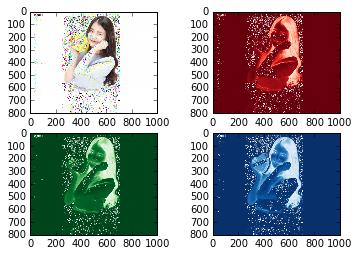

UECM3033 Assignment #2 Report
========================================================

- Prepared by: Lee Kah Woh
- Tutorial Group: T2

--------------------------------------------------------

## Task 1 --  $LU$ Factorization or SOR method

The reports, codes and supporting documents are to be uploaded to Github at: 

https://github.com/LeeKahWoh/UECM3033_assign2

Explain your selection criteria here.
By using if-else statement,the condition is set to be np.count_nonzero(A) > 1/2*len(A).
If the nonzeros is greater than half of the length of matrix A,then LU method will be chosen.
If the nonzeros is less than half of the length of matrix A,then SOR method will be chosen.

Explain how you implement your `task1.py` here.
First of all,assume the iteration limit to be 10.
Iteration limit is set so that infnite loop will not occur.
Then,I created self define function of lu, sor and solve.
I started editing function of LU method, I created two matrices which is the lower triangular matrix and upper triangular matrix whereby A=LU, therefore Ax=LUx=b.
And this will lead us to Ly=b and Ux= y.
At this moment, we can get the x matrix right after getting the y matrix.
Then we move on to SOR method, I set omega to be 1.03 which is within the range of 1 < omega < 2 that will converge for any initial vector if matrix A is symmetric and positive definite.
If omega is greater than 2, the SOR method will diverge.
If 0 < omega < 1, SOR method converges but the convergence rate is slower than the Gauss-Seidal method.
Iteration was started by assuming the first x is a zero vector.
Then, we will substitute each x we get to calculate the new x and iterate until it reach the iteration limit.
To get the exact answer, we shall let sol equal to np.linalg.solve(A,b) or else the answer will not be true. 

---------------------------------------------------------

## Task 2 -- SVD method and image compression

Put here your picture file (Pic.jpg)

How many non zero element in $\Sigma$?
All the three red, green and blue $\Sigma$ are non zero elements. 

Put here your lower and better resolution pictures.
When the resolution is lower , $\Sigma_{30}$

When the resolution is better, $\Sigma_{200}$

Explain how you generate these pictures from `task2.py`.
First and foremost, by using github, push the new image "Pic".
Then, we will need to get the three matrices r,g,b by reading the image.
Using scipy.linalg.svd to find U,$\Sigma$ and V of the three matrices.
Plot the image by using "plt.figure".
numpy.count_nonzero is used to find the non zero elements in $\Sigma$.
The image is compressed by keeping the first 30 non zero elements as in $\Sigma$ and set all other non zero elements to zero.
This will end up constructing a lower resolution matrix.
Create a self define function and then make a copy of the original $\Sigma$ by using Sr.copy, Sg.copy and Sb.copy.
This copy is for the avoid the loss of information.
We start to keep the first n non zero elements and set others to zero by using Sr1[n:800]=np.zeros_like(Sr[n:800]).
After that, I change Sr1 to dimension (800x1000) which is originally (800,1) by using sp.linalg.diagsvd.
This is to ensure that no dimensional error will occur when combine it to a matrix of U,$\Sigma$,V by dot multiplication.
Thus, a new matrix is created by the dot multiplication of np.dot.
All the process is repeated by green and blue matrices.
After those steps, plot another figure which shows a lower resolution.
Lastly, plot a new better resolution by calling the self define function again.

What is a sparse matrix?
A sparse matrix is a matrix which most of the elements are zero.
In the other way, a matrix is considered dense if most of the elements are non zero.
The fraction of non-zero elements over the total number of elements in a matrix is called the sparsity,also known as density.
Basically we are trying to create a large sparse matrix so that we can create a new lower resolution picture of the original picture.
By applying in this task, sparse matrix is formed when the first 30 elements of $\Sigma$ is kept and other elements are set to zero.
When the dimension of $\Sigma$ is converted to (800,1000), which is consider as a large sparse matrix, then this will create a lower resolution of pictures when it is combined with U and V by using dot multiplication. 

-----------------------------------

last modified: 10 March 2016
